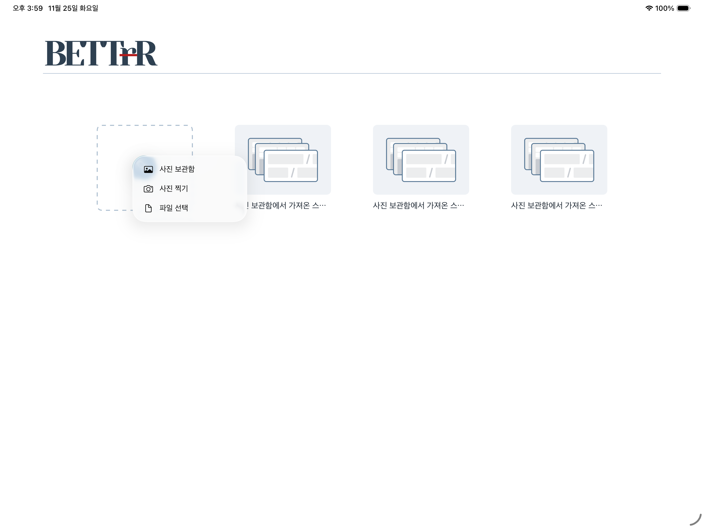
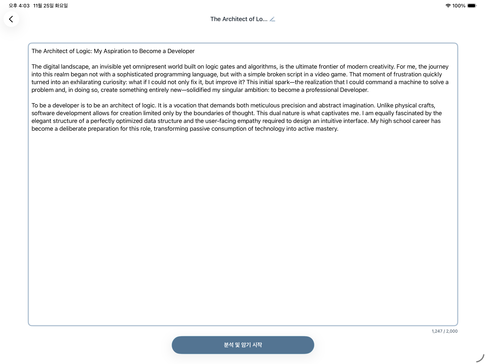
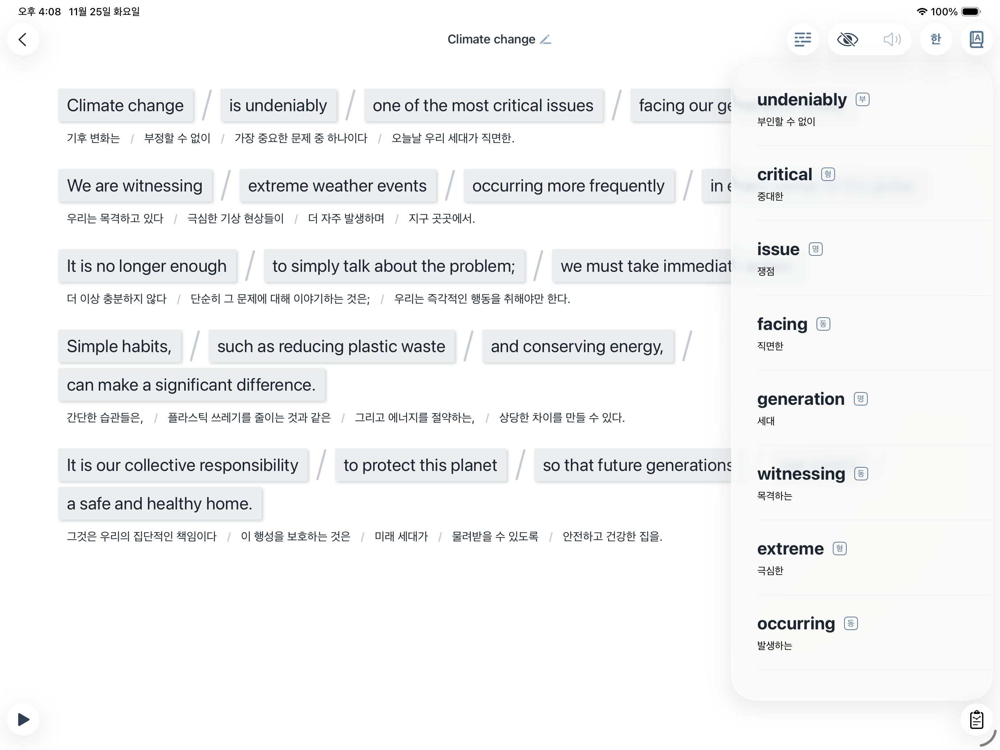
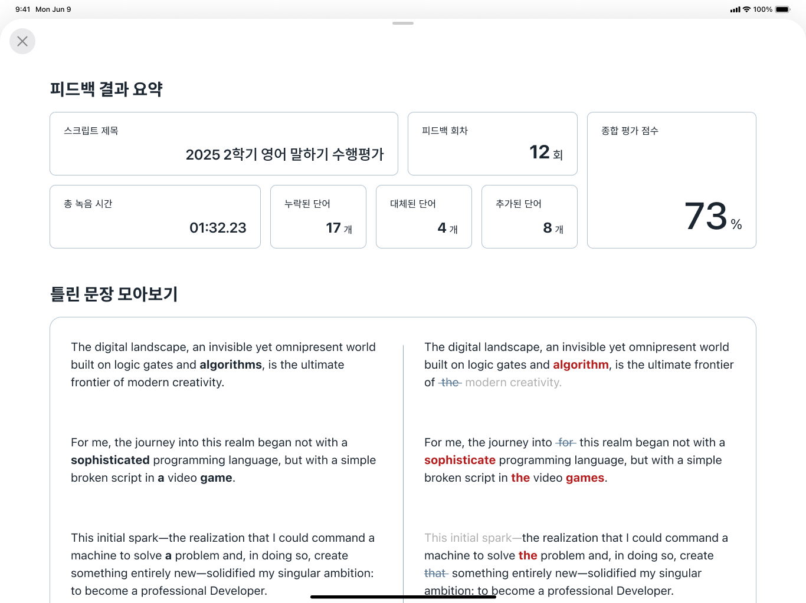

# :rocket: BETTrR


> 영어 스크립트 암기를 위한 스마트 학습 도우미 - 녹음 확인 시간은 아끼고, 암기에만 집중하세요.

[]()
[]()
[]()
[]()

---

## :card_index_dividers: 목차

- [소개](#iphone-소개)
- [프로젝트 기간](#calendar-프로젝트-기간)
- [기술 스택](#hammer_and_wrench-기술-스택)
- [주요 기능](#star2-주요-기능)
- [화면 구성](#framed_picture-화면-구성-및-시연)
- [폴더 구조](#bricks-폴더-구조)
- [팀 소개](#technologist-팀-소개)
- [브랜치 전략](#bookmark-브랜치-전략)
- [커밋 컨벤션](#cyclone-커밋-메시지-컨벤션)
- [테스트 방법](#white_check_mark-테스트-방법)
- [프로젝트 문서](#paperclip-프로젝트-문서)
- [라이선스](#scroll-license)

---

## :iphone: 소개

**BETTrR**은 영어 발표나 스크립트를 암기할 때 겪는 가장 큰 고민을 해결합니다.

> "녹음 파일을 돌려 들으며 틀린 곳을 찾는 시간, 이제 낭비하지 마세요!"

- :hourglass_flowing_sand: **시간 절약**: 10분짜리 발표에서 10초 실수를 찾기 위해 전체를 다시 듣지 마세요
- :dart: **정확한 피드백**: AI가 틀린 부분만 빨간색으로 표시해 줍니다
- :iphone: **올인원 솔루션**: 단어 검색, 발음 듣기, 녹음, 채점까지 한 앱에서

**타겟 사용자**: 영어 스크립트 암기가 필요한 학생, 직장인, 발표자  
**핵심 가치**: 시간 절약 & 몰입 극대화

[:link: App Store에서 다운로드](https://apps.apple.com/kr/app/bettrr/id6754756492)

---

## :calendar: 프로젝트 기간

- 전체 기간: `2025.09 - 2025.11`
- 개발 기간: `2025.10.28 - 2025.11.25`
- 배포일: `2025.11.17`

---

## :hammer_and_wrench: 기술 스택

### Development
- **Language**: Swift 5.0
- **Framework**: SwiftUI
- **Architecture**: MVVM
- **Minimum iOS**: 26.0+

### AI & Speech
- **Google Gemini AI**: 스크립트 문장 분리 및 텍스트 비교 분석
- **Apple Speech Framework**: 온디바이스 음성 인식 (STT)
- **Apple Vision Framework**: 이미지 기반 텍스트 추출 (OCR)

### Tools & Collaboration
- **Design**: Figma
- **Project Management**: Notion, GitHub Projects
- **Version Control**: Git, GitHub

---

## :star2: 주요 기능

### 1️⃣ 스마트 문장 분리 (Chunking)
- 긴 스크립트를 문장 단위로 자동 분리
- 한 번에 외우지 말고, 문장별로 쪼개서 공략
- Google Gemini AI 기반 자연어 처리

### 2️⃣ 실시간 음성 인식 및 오류 검출
- 사용자의 발음을 텍스트로 변환 (Apple Speech Framework)
- 원본 스크립트와 실시간 비교
- **틀린 단어는 빨간색**, **대체된 단어는 취소선**으로 표시

### 3️⃣ 올인원 암기 모드
- 단어장
- 발음 듣기 (TTS)
- 녹음 및 즉시 피드백
- 앱 이동 없이 한 화면에서 완성

### 4️⃣ 이미지 기반 텍스트 추출
- 사진 속 영어 텍스트 자동 인식 (Vision Framework)

---

## :framed_picture: 화면 구성 및 시연

| 기능 | 설명 | 이미지 |
|------|------|--------|
| 스크립트 입력 | 이미지 스캔 또는 파일 선택 |  |
| 스크립트 확인 및 분석 요청 | 텍스트 편집 및 제목 수정 |  |
| 암기 모드 | AI 기반 자동 청킹, 해석, 단어장 |  |
| 피드백 화면 | 틀린 단어 하이라이트 |  |

---

## :bricks: 폴더 구조

```
📦BETTrR
...
┣ 📂 Bettr/                          # 주 애플리케이션 및 테스트 코드
┃ ┣ 📂 Bettr/                        # Bettr 애플리케이션 소스 코드
┃ ┃ ┣ 📂 Domain/                     # 도메인 계층 (비즈니스 로직 및 데이터 모델)
┃ ┃ ┃ ┣ 📂 DTOs/                     # 데이터 전송 객체
┃ ┃ ┃ ┣ 📂 Models/                   # 핵심 데이터 모델
┃ ┃ ┃ ┣ 📂 Repositories/             # 데이터 저장소 인터페이스
┃ ┃ ┃ └ 📂 Services/                 # 도메인 서비스 (비즈니스 로직)
┃ ┃ ┣ 📂 Extensions/                 # Swift 기본 타입 확장
┃ ┃ ┣ 📂 Persistence/                # 데이터 영속성 (SwiftData) 관련 코드
┃ ┃ ┣ 📂 Presentation/               # UI (사용자 인터페이스) 계층
┃ ┃ ┃ ┣ 📂 Common/                   # 공통 UI 컴포넌트 및 유틸리티
┃ ┃ ┃ ┣ 📂 Features/                 # 기능별 뷰 및 뷰모델
┃ ┃ ┃ ┃ ┣ 📂 FeedbackHistory/       # 피드백 기록 화면
┃ ┃ ┃ ┃ ┣ 📂 FeedbackResult/        # 피드백 결과 화면
┃ ┃ ┃ ┃ ┣ 📂 Home/                   # 홈 화면
┃ ┃ ┃ ┃ ┣ 📂 Memorization/          # 암기 모드 화면
┃ ┃ ┃ ┃ ┣ 📂 Recording/             # 녹음 화면
┃ ┃ ┃ ┃ └ 📂 ScriptConfirm/         # 스크립트 확인 화면
┃ ┃ ┃ ┣ 📂 Navigation/               # 화면 전환 로직
┃ ┃ ┃ └ 📂 Services/                 # UI 계층 서비스 (오디오 재생, 텍스트 분석)
┃ ┃ ┣ 📂 Resources/                  # 앱 리소스 (폰트, 이미지, Lottie 애니메이션)
┃ ┃ └ 📂 Utils/                      # 유틸리티 함수 및 헬퍼 클래스
┃ ┣ 📂 Bettr.xcodeproj/              # Xcode 프로젝트 설정 파일
┃ └ 📂 BettrTests/                   # 유닛 및 통합 테스트 코드
...
```

### 아키텍처 설명

**Domain Layer (도메인 계층)**
- 비즈니스 로직과 데이터 모델의 핵심
- UI나 데이터베이스에 독립적인 순수한 로직

**Presentation Layer (프레젠테이션 계층)**
- SwiftUI 기반의 사용자 인터페이스
- MVVM 패턴으로 뷰와 비즈니스 로직 분리
- 기능별로 독립적인 모듈 구성

**Persistence Layer (영속성 계층)**
- GRDB를 활용한 로컬 데이터 저장
- 스크립트 및 학습 기록 관리

---

## :technologist: 팀 소개

| 닉네임 | 역할 | GitHub |
|------|------|--------|
| **Dewy** | PM, iOS Developer | [@doyeonyyy](https://github.com/doyeonyyy) |
| **Oliver** | Tech Lead, iOS Developer | [@cherry-go-round](https://github.com/cherry-go-round) |
| **Cerin** | iOS Developer | [@OCerin](https://github.com/CerinSeo) |
| **Rohd** | iOS Developer | [@Rohd](https://github.com/JeongsuGil) |
| **Isa** | iOS Developer | [@Isa](https://github.com/ChocopieA) |
| **Excellenty** | UI/UX Designer | [@Excellenty](https://github.com/Excellenty-ada25) |

**Team D.U.** - Developer Academy @ POSTECH  
[:link: 프로젝트 웹사이트](https://developeracademy-postech.github.io/2025-C6-A-T14-BETTrR/)

---

## :bookmark: 브랜치 전략

[Gitflow](https://www.atlassian.com/git/tutorials/comparing-workflows/gitflow-workflow)


---

## :cyclone: 커밋 메시지 컨벤션

[Conventional Commits](https://www.conventionalcommits.org) 기반

### 예시
- `feat: 음성 인식 기능 추가`
- `fix: 문장 분리 시 크래시 수정`
- `refactor: ViewModel 구조 개선`
- `style: UI 컴포넌트 색상 수정`
- `docs: README 업데이트`
- `deploy: v1.0.0 릴리스`

---

## :white_check_mark: 테스트 방법

### 1. 저장소 클론
```bash
git clone https://github.com/DeveloperAcademy-POSTECH/2025-C6-A-T14-BETTrR.git
cd 2025-C6-A-T14-BETTrR
```

### 2. 필수 설정
- Xcode 26.0 이상 설치
- iPadOS 26.0+ 시뮬레이터 또는 실제 기기 (AI 분석 요청, 음성 인식)

---

## :paperclip: 프로젝트 문서

- [:globe_with_meridians: 프로젝트 웹사이트](https://developeracademy-postech.github.io/2025-C6-A-T14-BETTrR/)
- [:iphone: App Store 페이지](https://apps.apple.com/kr/app/bettrr/id6754756492)

---

## :scroll: License

This project is licensed under the MIT License.

```
MIT License

Copyright (c) 2025 Team D.U.

Permission is hereby granted, free of charge, to any person obtaining a copy
of this software and associated documentation files (the "Software"), to deal
in the Software without restriction...
```

---

## :email: Contact

프로젝트에 대한 문의사항이나 피드백은 아래로 연락 주세요:

- **Email**: [대표 이메일](mailto:doyeonyyy@gmail.com)
- **GitHub Issues**: [이슈 등록](https://github.com/DeveloperAcademy-POSTECH/2025-C6-A-T14-BETTrR/issues)
- **Website**: [Contact Page](https://developeracademy-postech.github.io/2025-C6-A-T14-BETTrR/contact.html)

---

<div align="center">

**copyright&copy;2025Team D.U. All rights reserved.**

[:arrow_up: Back to Top](#rocket-bettrr)

</div>
